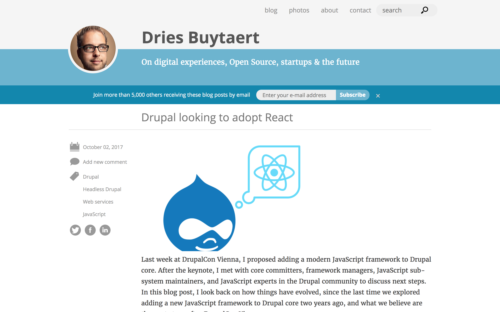

> 

> # Decoupled in practice: the modern web frontend

> Kristjan Jansen / kogu.io
> Drupalcamp Baltics
> Vilnius 2018

---

# About me

I am Kristjan Jansen, interaction designer and full stack developer with over 12 years of experience.

I am prototyping digital products, build design systems, lead and mentor tech teams and teach the next generation of designers.

I am currently working on [kogu.io](http://google.com), a data science tooling startup to build the best possible user experience for AI development.

---

---

---

> # Drupal is _very likely_ going for React

