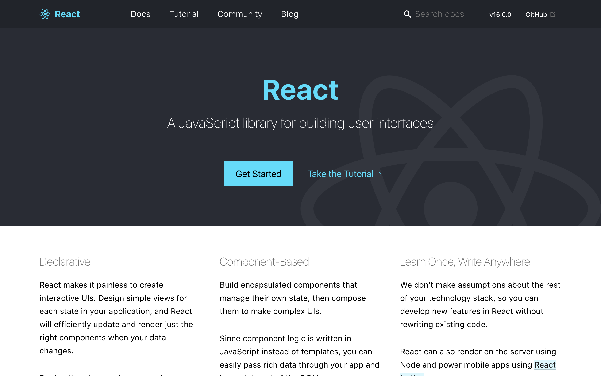
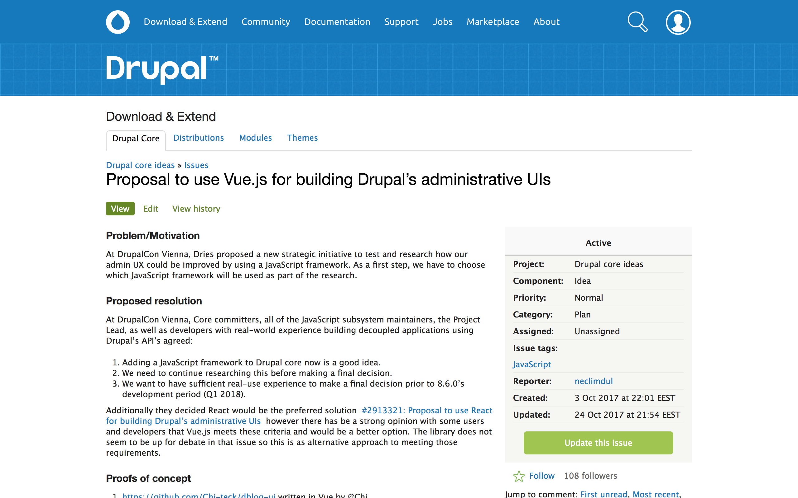

> 

> # &nbsp;&nbsp;Decoupled in practice:<br>the modern web frontend

> Kristjan Jansen
> Drupalcamp Baltics
> Vilnius 2017

---

> 

> # Headless in practice:<br>the modern web frontend

> Kristjan Jansen
> Drupalcamp Baltics
> Vilnius 2017

---

# Follow along

### Slides

https://github.com/kristjanjansen/vilnius
http://kristjanjansen.ee/vilnius/

### Example project

https://github.com/kristjanjansen/drupal_example


---

# About me

I am **Kristjan Jansen**

I am **prototyping** digital products, **develop** design systems and fullstack code, **mentor** tech teams and **teach** the next generation of designers.

---

# About me

I am working for **Proekspert**, a data science company building the best possible user experience for AI development.

https://proekspert.ee

---


---

# About me

I am also a Drupal oldie

https://www.drupal.org/user/11

I made some early core themes, helped on user experience, founded Estonian Drupal community and I am a co-author of Druplicon.

---


---

# What we gonna be talking about?

Let's follow up on Ruben's talk:

* What does decoupled / headless Drupal building mean **in practice**?
* How should I **start learning modern frontend** tools?
* When to use decoupled Drupal?

---

# Let's get started 

Three ways to get the data out of Drupal (and into Drupal) using APIs:

---
### REST API

In core

Needs configuration

You have to invent<br>your own standard
--

### JSON API

Soon in core (8.5 / 8.6)

No config, works out of box

Based on<br>industry standard

Good tooling available

--

### GraphQL

Someday in core

Some config needed

By Facebook,<br>now a industry standard

Good tooling available

Drupal module just getting stabile
---

# JSON API

Lets get started

```
composer require drupal/jsonapi
drupal module:install jsonapi
```

---

# Demo time

https://github.com/kristjanjansen/drupal_example

---

# Takeaways from demo

* JSON API data needs extra processing to be usable, for example `jsonapi-parse` in NPM
* You will have to create your own `format_*` functions
* Not all content on page can be included on a single request

---

# Getting all the data for the page

```
const uuid = '95a0a7b9-1d7e-4766-a412-fdf4da2099ba'

// 1. Get the article

axios.get('node/article/' + uuid)
  .then( /* do something with article data */ )

// 2. Get its comments

axios.get('comment/comment'), { params: { 'filter[entity_id.uuid]⌈value⌉': uuid } })
  .then( /* do something with comments data */ )

// 3. Get logged in user...
// 4. Get related articles...

```

---

# Lets start with frameworks

As the time of writing...

---


---



---

## Javascript

```


export default title => `
  <header>
    <a href="/">
      <h1>${ title }</h1>
    </a>
  </header>
`
```
--

## Vue

```


export default {
  template: `
    <header>
      <a href="/">
        <h1>{{ title }}</h1>
      </a>
    </header>
  `,
  props: ['title']
}
```

--

## React

```
import React from 'react'

export default ({ title }) =>
    <header>
        <a href="/">
            <h1>{ title }</h1>
        </a>
    </header>
```
---

### &nbsp;

**Development**

**Production**

--

## Javascript

Latest browsers

—

--

## Vue

Latest browsers

⚒ Needs compilation 

--

## React

⚒ Needs compilation 

⚒ Needs compilation 


---

# Use React in your Drupal theme

1. Install NodeJS https://nodejs.org
2. Add the following three files to Drupal root
3. Run
   
```
npm install
npm run build
```

---

```
// webpack.config.js

module.exports = options => {
  return {
    entry: './themes/custom/example_react/src/main.js',
    output: {
      path: require('path')
        .resolve(__dirname, './sites/default/files/dist'),
        filename: 'build.js'
    },
    module: {
      rules: [{
        test: /.js$/,
        exclude: /node_modules/,
        use: [{
          loader: 'babel-loader',
          options: { cacheDirectory: true },
        }],
      }],
    },
  }
}
```

--

```
// package.json

{
  "name": "example",
  "private": "true",
  "scripts": {
    "build": "webpack --hide-modules",
    "build": "webpack --hide-modules --watch",
  },
  "devDependencies": {
    "babel-core": "^6.22.0",
    "babel-loader": "^6.2.10",
    "babel-plugin-transform-runtime": "^6.22.0",
    "babel-preset-env": "^1.5.2",
    "babel-preset-react": "^6.22.0",
    "babel-preset-stage-1": "^6.22.0",
    "webpack": "^2.2.0",
  },
  "dependencies": {
    "babel-runtime": "^6.23.0",
    "react": "^15.6.1",
    "react-dom": "^15.6.1"
  }
}
```
--

```
// .babelrc

{
  "presets": [
    ["env", {"modules": false}],
    "stage-1",
    "react"
  ],
  "plugins": [
    "transform-runtime"
  ]
}
```

---

# Takeaway from the framework demos

* The frameworks are more similar than we think
* For experimentation you do not need framework at all
* *Learn modern Javascript first*. It will be here for a long time

---

# Getting started with frameworks

http://javascript.info

https://vuejs.org/v2/guide

http://www.react.express
https://www.webpackbin.com

---

> # When to use decoupled Drupal?

> What will we lose? What will we win?

---

### What we lose<br>in theming
 
* Helper functions for data rendering
* Accessibility markup
* Search engine optimization
* Localization
* RDF 🤓

--

### What we lose<br>in development

* Authentication and authorization
* Form building and validation
* Testing

--

### What we lose<br>in admin

* In-place editing
* Contextual links
* Toolbar
* Layout management
* Settings tray
* Content preview (soon Workspaces)

---

# What we will win?

We never exposed the true power of modern frontend frameworks, they are not just template engines.

--

<br>

* State management 
* Reactivity
* Realtime data
* Complex animation
* Data visualization

--

<br>

* Server rendering
* Offline apps
* Rendering to other platforms: native apps, VR etc

---

<video autoplay="" class="wp-video-shortcode" id="video-6877-1" width="928" height="513" preload="metadata" src="https://airbnb.design/wp-content/uploads/2017/10/WireframeClassifiersmall.mp4?_=1" style="width: 100%; height: 100%;"></video>

---

<br><br><br><br>
> https://learningmusic.ableton.com/

---

# What we will win?

Perhaps the biggest gains are not technical nor fancy

---
<br>
> # Freedom

---

# More choices to set up your products and teams

* Developing backend and frontend in different speeds
* Allows more experimentation on technologies, attract talent
* Hiring developers without forcing Drupal on them

---

> # Meanwhile in Drupal issue queue

---


---



---

> # Let's start learning, now 

---

# Thanks!

### Slides

http://kristjanjansen.ee/vilnius/
https://github.com/kristjanjansen/vilnius

### Example project

https://github.com/kristjanjansen/drupal_example
